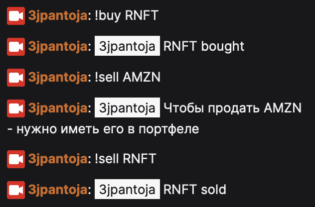

## Что это такое?

Это веб-приложение, с помощью которого стримеры дают возможность своей аудитории на twitch проводить сделки на своем инвестиционном счете в Тинькофф посредством команд в чате: <b>!buy</b> и <b>!sell</b>.

<br/>

## Сценарий использования

1. Стример объявляет о начале трейдинга вместе со всей своей аудиторией (допустим 5к зрителей).
2. Начальная сумма, которая будет доступна для трейдинга - 50.000 рублей.
3. Устанавливается пул доступных для трейдинга бумаг (это может быть или голосование, или рандом, или выбор прайм-участников и т.д.). Для нашего примера возьмем 10 бумаг. Стример должен учитывать, что бумаги должны быть не слишком дорогие, чтобы начальная сумма не была быстро потрачена на бумаги (пример-amzn 2,261 USD)
4. Дальше стример показывает дашборд, на котором виден текущий портфель, изменение его показателей, на сколько мы в плюсе и т.д. 
5. В чате начинается вакханалия из !sell YNDX, !buy TSLA, !buy TCS, !sell TCS ...
6. В конце такого ивента, стример подводит итоги, общается и обсуждает с чатом происходящее.

<br/>

## Почему это выгодно?

1. Это будет возможно только с Tinkoff Инвестициями.
2. Стример заинтересован в этом сервисе, так как по его реферальной ссылке будут оформлять карты.
3. Tinkoff заинтересован в этом сервисе, так как позволяет расширить спектр использования api на рынок развлечений, а также привлечь новую аудиторию.
4. Возможности для улучшения продукта - например добавление новых площадок (youtube, telegram), или добавление нового функционала (составление инвестиционного портфеля прайм-участниками или покупка одной бумаги за подписку).

<br/>

## Доступный функционал

🌀 Регистрация пользователя.

✅ Подключение twitch-аккаунта.

✅ Подключение tinkoff-аккаунта.

🌀 Выбор тикеров для использования.

✅ Покупка бумаги по рыночной стоимости.

✅ Продажа бумаги по рыночной стоимости.

<br/>

## Пример работы


<br/>

## Как это повторить?

Клонируем репозиторий

```
git clone https://github.com/valerii-chirkov/tinkoff-contest.git
```

Апгрейдим pip
```
pip install --upgrade pip
```

Заходим в папку tinkoff-contest и устанавливаем нужные пакеты

```
pip install -r requirements.txt
```

Прописываем данные для api в <b>tinkoff_creds.py</b> и  <b>twitch_creds.py</b>. Инструкции по получению данных лежат в самих файлах.

Для тестирования бота, приложил <b>_twitch_creds.py</b>, просто скопировать содержимое и вставить в <b>twitch_creds.py</b>.

Запускаем бота
```
python3 bot.py
```