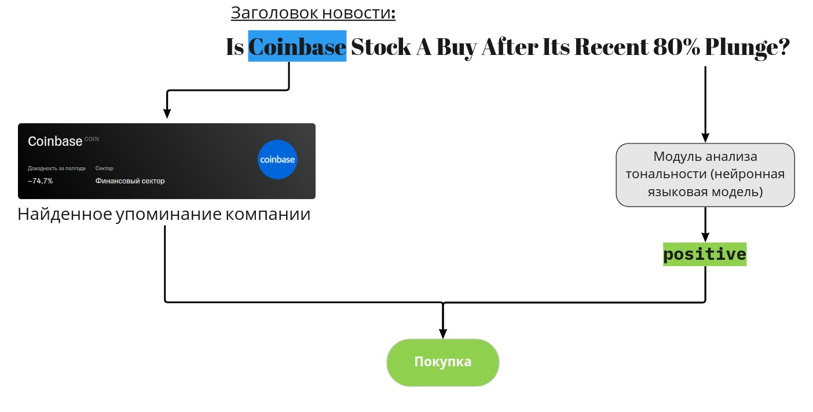

# Tinvest Robot Perevalov


Tinvest Robot Perevalov - это [Python Библиотека](https://pypi.org/project/tinvest-robot-perevalov/), реализующая функциональность торгового робота на основе [Tinkoff Invest API для Python](https://github.com/Tinkoff/invest-python) с торговой стратегией, [**основанной на анализе тональности новостей**](https://ru.wikipedia.org/wiki/%D0%90%D0%BD%D0%B0%D0%BB%D0%B8%D0%B7_%D1%82%D0%BE%D0%BD%D0%B0%D0%BB%D1%8C%D0%BD%D0%BE%D1%81%D1%82%D0%B8_%D1%82%D0%B5%D0%BA%D1%81%D1%82%D0%B0).

`app_name` по умолчанию: `https://github.com/Perevalov/tinvest_robot`

## Описание торговой стратегии

**Торговая стратегия** основана на **анализе тональности новостей**. При получении новой новости производится анализ её тональности, в результате которого получаем один из трёх классов: `positive`, `negative`, или `neutral`.
После чего, **проверяется наличие упоминания той или иной компании в заголовке новости**.
Если компания упомянута, то в случае новости с классом `positive` посылается сигнал на **покупку** акций в заданном количестве.
Если новость с классом `negative`, то посылается сигнал на **продажу** акций в заданном количестве.

Ниже на рисунке представлена концептуальная схема стратегии на определённом примере.



Как видно, ключевым звеном является модуль анализа тональности, в качестве которого используется предобученная нейронная языковая модель (neural language model).

## Тестирование торговой стратегии (Backtesting)

Тестирование стратегии проводилось на наборе данных новостей ["Historical financial news archive"](https://www.kaggle.com/datasets/gennadiyr/us-equities-news-data), который содержит в себе новостные данные по 800 компаниям из США за 12 лет (2008-2020).

В ходе тестирования был выбран диапазон **с 2012 по 2020 годы** включительно по **100 наиболее упоминаемым компаниям** из набора данных. Поскольку некоторые компании оказались недоступны через сервис Тинькофф Инвестиции, в итоге в процедуру тестирования было включено **90 компаний**.

В рамках наблюдаемого года (например 2013) бралось соответствующее подмножество новостей **упорядоченных по дате** по возрастанию. После чего по каждой из компаний проверялось упоминание в той или иной новости и далее использовался алгоритм **стратегии** описанной выше со **следующими условиями**:

* Комиссия за операции не учитывалась;
* Покупка в шорт (в минус) недоступна;
* Покупка и продажа производится по одному лоту за раз;
* Финансовый результат считался по определённой бумаге за конкретный год;
* Данные по цене (свечи) брались из API Тинькофф Инвестиции;
* Если на конец года на балансе имелось ненулевой число акций, то финальный баланс на год рассчитывался по цене закрытия бумаг в последний торговый день года.

Ниже представленые некоторые графики по результатам тестирования.


На графике мы видим, что доходность была положительной почти на всех годах, за исключением 2018. Также, очевидно что доходность не зависит от количества операций по бумагам (это было так же подтверждено анализом коррелляции).


На графике не уместились все тикеры, однако в топ-3 самых доходных компаний входят: TSLA (64.72%), NFLX (28.62%), AAPL (18.68%) в среднем за год. Также, очевидно, что большинство бумаг оказались с положительной доходностью.

Тестирование можно воспроизвести с помощью данного [ноутбука](https://github.com/Perevalov/tinvest_robot/blob/master/examples/backtesting.ipynb) скачав перед этим [датасет](https://www.kaggle.com/datasets/gennadiyr/us-equities-news-data). Экспериментальные данные тестирования доступны [тут](https://github.com/Perevalov/tinvest_robot/tree/master/data/backtesting).

## Как запустить решение (How to run)

Для запуска решения необходимо установить `Docker` и `Docker Compose` на вашей машине. После чего, необходимо перейти в директорию [`examples`](https://github.com/Perevalov/tinvest_robot/tree/master/examples) и запустить там следующие команды:

```bash
docker-compose build
docker-compose up
```

После чего, запустится 3 контейнера:

* `fetch` -- контейнер для получения новостей из интернета (запускается сразу или через интервал, указанный в [примере](https://github.com/Perevalov/tinvest_robot/blob/master/examples/fetch.py));
* `trade` -- контейнер для совершения торговых операций, мониторит полученные новости через определённый интервал, указанный [тут](https://github.com/Perevalov/tinvest_robot/blob/master/examples/trade.py).
* `sqlite-web` -- позволяет следить за полученными новостями и исполненными операциями в базе данных через веб-интерфейс (по умолчанию порт `8080`).

Внимание, перед тем как запускать решение, необходимо создать `.env` файл с вашими конфигурационными параметрами. Пример конфигурационного файла:

```env
TINVEST_ACCOUNT_ID=200000000
TINVEST_DB_NAME=../data/tinvest-perevalov.sqlite
SENTIMENT_MODEL=cardiffnlp/twitter-roberta-base-sentiment
TINVEST_TOKEN=t.YoUr.tInVeSt.token
IS_SANDBOX=True
TINVEST_TICKERS=CSCO,AAPL
```

Описание параметров:
* `TINVEST_ACCOUNT_ID`: Идентификатор счета в тинькофф инвестициях (или в песочнице)
* `TINVEST_DB_NAME`: Имя базы данных где будуn храниться новости и данные об операциях (если меняете относительный путь, то необходимо изменить volume в `docker-compose.yml`)
* `SENTIMENT_MODEL`: Имя модели для обработки новостей (в данный момент поддерживается только эта модель)
* `TINVEST_TOKEN`: Токен для доступа к тинькофф инвестициям
* `IS_SANDBOX`: Признак того, работаем ли мы в песочнице
* `TINVEST_TICKERS`: Список тикеров для торговли через запятую

## Ограничения и планы на будущее

Основными ограничениями решения можно считать:
* Торговля только на СПб Бирже (из-за использования англоязычной модели анализа новостей);
* Торговля по одному лоту на бумагу;
* Стратегия "захардкожена" внутри библиотеки.

Однако, в будущем планируются следующие улучшения:
* Поддержка нескольких бирж для торговли;
* Поддержка нескольких моделей анализа новостей;
* Кастомизация стратегии;
* Коннекторы для использования разных БД.
