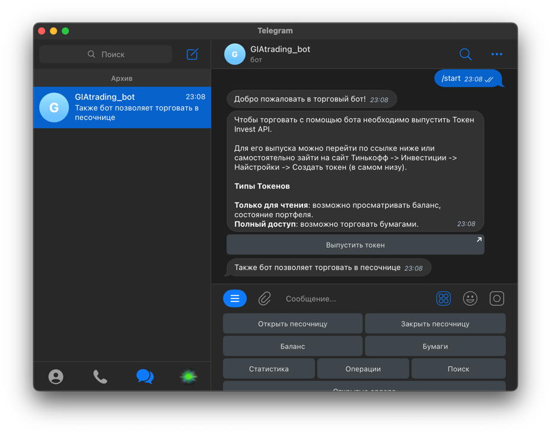
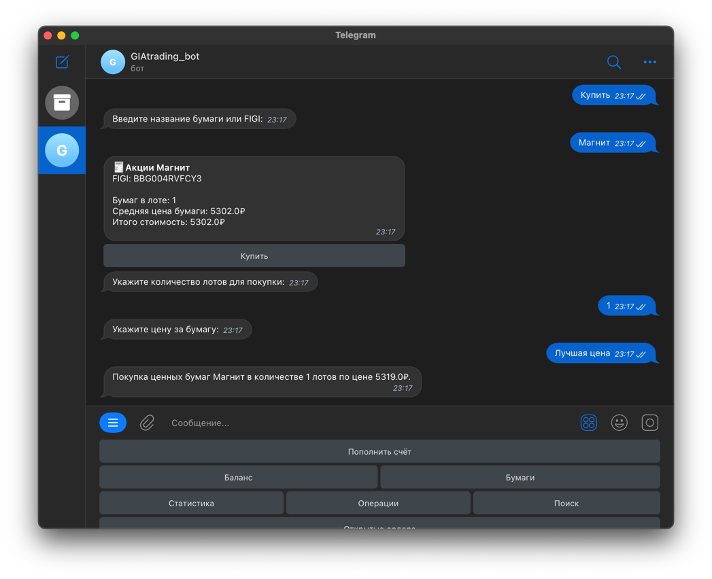
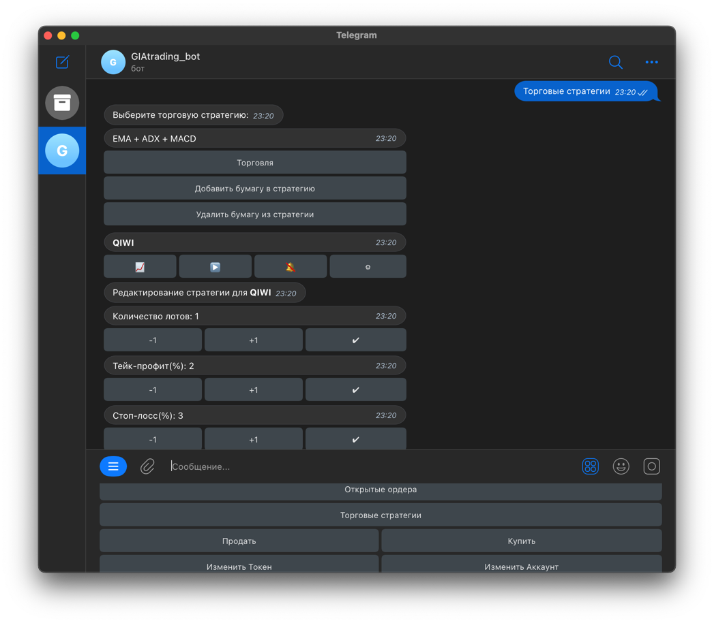
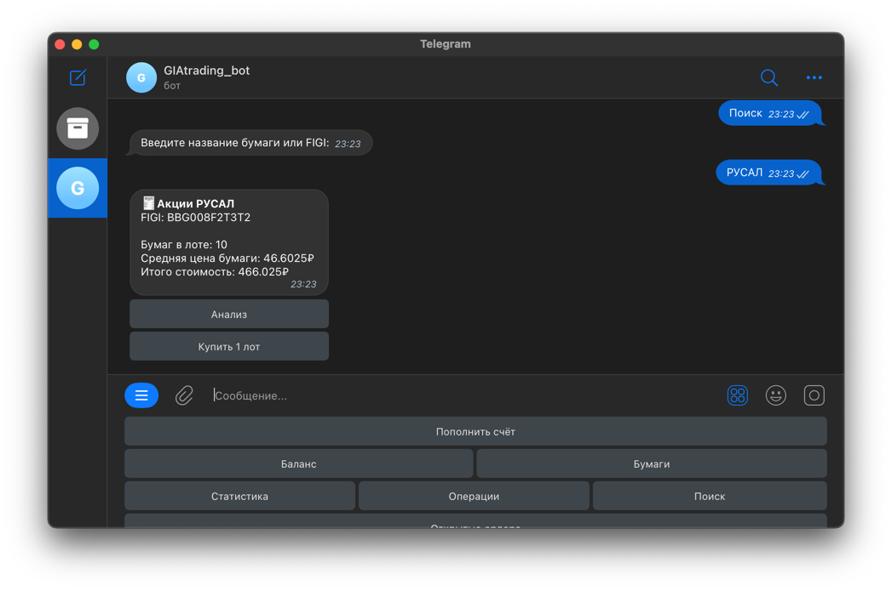
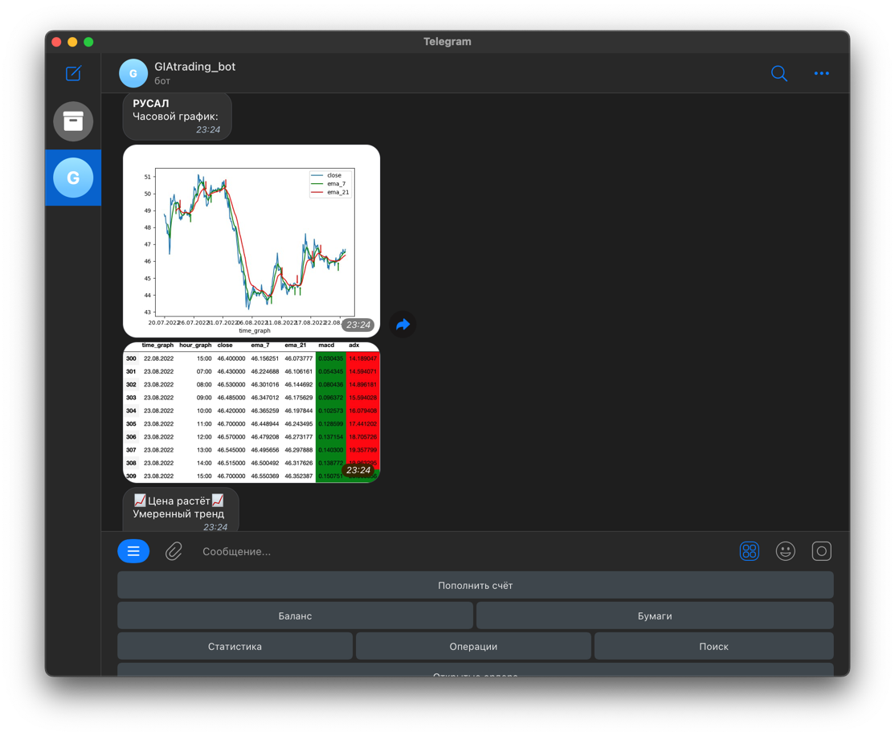
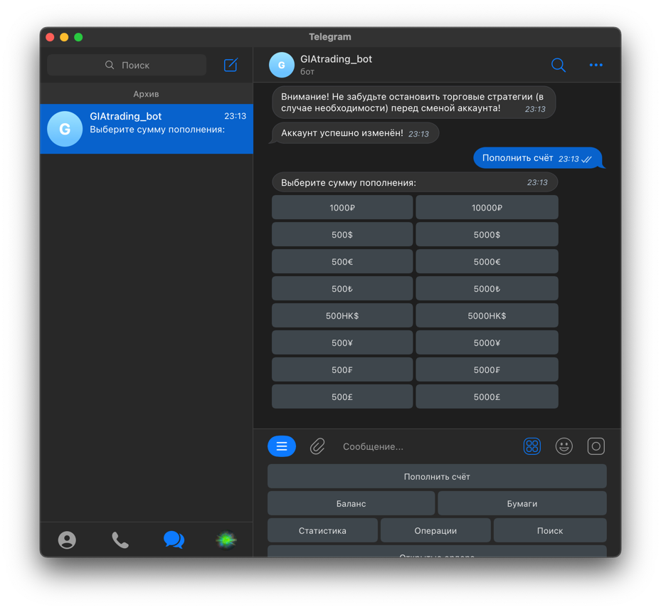
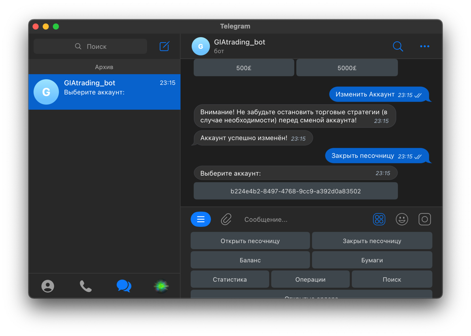
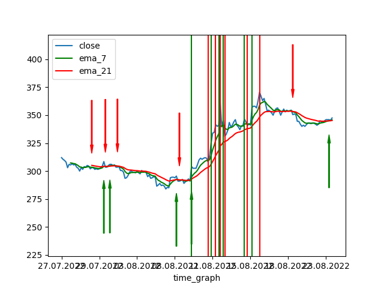
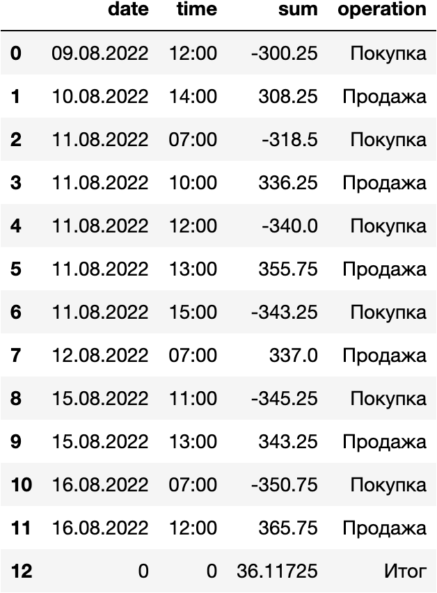
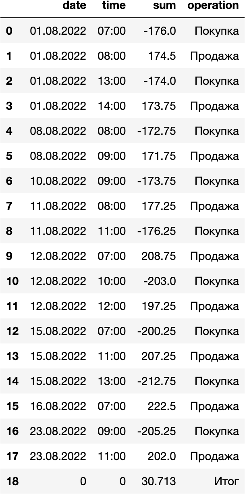

# Торговый робот для Тинькофф Инвестиции

---

⚠ ВНИМАНИЕ ⚠

Данный бот рекомендуется использовать только в ознакомительных целях.

**Торговый робот не гарантирует получение прибыли.** 

Перед использованием торгового бота необходимо тщательно изучить рынок, а также акции, которые Вы планируете использовать для торговли.

Для наилучшей торговли различные акции требуют индивидуальной настройки торговой стратегии.

⚠ ВНИМАНИЕ ⚠

---

## <a name="content">Оглавление</a>

0. [Описание](#description)
   1. [Обычный режим](#normal)
   2. [Песочница](#sandbox)
1. [Запуск](#start)
2. [Requirements](#requirements)
3. [Интерфейс](#interface)
4. [Торговая стратегия](#strategy)
5. [Тестирование эффективности](#testing)
6. [Структура проекта](#structure)
7. [Контакты](#contacts)
8. [Планы](#plans)

---

## <a name="description">Описание</a>

Данный торговый робот представляет собой телеграм-бот, который позволяет:
- Просматривать доступную валюту на счёте
- Просматривать доступные бумаги на счёте
- Просматривать открытые ордера и закрывать их по требованию
- Покупать ценные бумаги в чате
- Продавать ценные бумаги в чате
- Просматривать статистику по торговым стратегиям
- Выводить часовые и 15-минутные графики с торговыми индикаторами
- Указывать направление и силу тренда акций
- Запускать или останавливать торговые стратегии из чата

Главное особенностью данного торгового бота является его понятность и простота в использовании. Любой пользователь может без предварительного изучения списка команд или теории по трейдингу воспользоваться данным проектом.

Предполагается, что пользователь будет использовать данного торгового робота в качестве **_вспомогательного_** инструмента для совершения сделок. 

В дальнейшем планируется доработать функционал, чтобы пользователи могли выбирать различные торговые стратегии, а также настраивать их под каждую конкретную акцию.

### <a name="normal">Обычный режим</a>

Пользователь может выбрать свой основной аккаунт Тинькофф Инвестиции для работы с торговым роботом.

В таком случае все операции будут проходить на реальном счёте:
- На покупку акций тратятся настоящие деньги с брокерского счёта;
- Покупаются/продаются настоящие акции, находящиеся в Вашем портфеле;
- Покупки/продажи осуществляются только во время работы биржи.

### <a name="sandbox">Песочница</a>

Для тестирования работы торгового робота пользователь может создать аккаунт-песочницу. Данное действие можно осущетсвить непосредственно в торговом боте.

Аккаунт-песочница позволяет:
- Добавлять неограниченное количество валюты на счёт;
- Покупать/продавать акции в неограниченном количестве;
- Покупать/продавать акции в любое время суток.

Песочница позволяет протестировать возможности торгового робота без рисков, так как все действия происходят на специальном счёте.

[🔝 Оглавление](#content)

---

## <a name="start">Запуск</a>

Для запуска торгового бота необходимо:
1. Создать файл .env (по примеру .env.example) с указанием токена Телеграм-бота.

BOT_TOKEN - токен бота телеграм

[Как создать телеграм бота](https://tlgrm.ru/docs/bots?ysclid=l76lujyi8v491651655)

2. Установить необходимые библиотеки из requirements.txt.

[🔝 Оглавление](#content)

---

## <a name="requirements">Requirements</a>

Для запуска торгового бота требуются следующий библиотеки, описанные в requirements.txt:

    aiogram~=2.20
    tinkoff-investments
    ta~=0.10.1
    pandas~=1.4.2
    matplotlib~=3.5.2
    python-dotenv~=0.20.0
    aioschedule~=0.5.2
    dataframe_image
    bcrypt~=3.2.2
    tinkoff~=0.1.1
    pytz~=2022.1
    python-Levenshtein
    Crypto
    pycryptodome
    pycbrf~=1.1.0
    rsa~=4.8

[🔝 Оглавление](#content)

---

## <a name="interface">Интерфейс</a>

Начало работы:

Покупка акции:

Добавление акции в торговую стратегию:

Настройка торговой стратегии:

Поиск бумаги:

Анализ бумаги:

### <a name="interface_sandbox">Песочница</a>

Добавление денег:

Закрытие песочницы:

[🔝 Оглавление](#content)

---

## <a name="strategy">Торговая стратегия</a>

При разработке данной стратегии было решено выбрать наиболее популярные и зарекомендовавшие себя индикаторы и составить набор правил, по которым будут совершаться покупки и продажи. В данной стратегии используется 4 индикатора:

- EMA с периодом 7 дней и EMA с периодом 21 день для определения точек входа и выхода из сделки;
- MACD для определения направления тренда;
- ADX для определения силы тренда.

Несмотря на то, что некоторые используемые индикаторы могут давать инвестору схожую информацию, было решено использовать их совместно для более точной работы стратегии.
    
**Покупка** будет осуществляться при выполнении всех условий сразу:
1. Линия быстрой скользящей средней (EMA 7) пересечёт снизу медленную скользящую среднюю (EMA 21) и будет находиться сверху – возрастающий тренд;
2. Уровень MACD будет находиться выше нуля – возрастающий тренд;
3. Уровень ADX будет больше 20 – цена не будет стоять на месте.

**Продажа** будет осуществлять при выполнении одного из условий:
1. Цена возросла достаточно (тейк-профит);
2. Цена опустилась слишком низко (стоп-лосс);
3. Линия быстрой скользящей средней (EMA 7) пересечёт сверху медленную скользящую среднюю (EMA 21) – начало убывающего тренда;
4. Консолидация MACD – уровень MACD стоит на одном месте долгое время, что может говорить о возможном развороте;
5. Резкое снижение уровня MACD – нисходящий тренд.

[🔝 Оглавление](#content)

---

## <a name="testing">Тестирование эффективности</a>

Для тестирования эффективности было решено запустить разработанный алгоритм на исторических данных за последние 3 недели. 

Алгоритм совершает покупки и продажи аналогично с реальными условиями. Только вместо выставления ордеров алгоритм хранит данные о всех возможных операциях в памяти. Данные о теоретических покупках и продажах заносятся в таблицу для дальнейшего анализа. 

Такой подход позволяет оперативно настраивать алгоритм, корректировать его параметры и исправлять ошибки. 

Стоит отметить, что все вычисления производятся только на основе значений за прошедшие периоды времени, поэтому 

### Акции QIWI

Проведём тестовый запуск алгоритма для акций QIWI.

На графике зелёными полосками выделены "теоретические" покупки, а красными - "теоретические" продажи.

Также стрелками показывается направление тренда.

В итоге мы также получаем таблицу со всеми операциями. Можно заметить, что большинство операций были успешными - алгоритм покупает по низкой цене и продаёт по высокой.

Также можно заметить, что не все операции были успешными, так как алгоритму приходилось продавать по цене ниже той, что была указан при покупке.

Тем не менее алгоритм показал положительный результат, и теоретически пользователь получил бы прибыль в 36₽ за 3 недели (около 12% от начальной стоимости акции).

### Акции СОЛЛЕРС

Аналогичный тестовый запуск алгоритма был проведён для акций СОЛЛЕРС.

Заметим, что теоретически пользователь также получит прибыль в 30₽ (около 17%).

### Вывод

Алгоритм доказал свою эффективность при работе на исторических данных. Таким образом, данный алгоритм можно применять в реальных условиях. 

Другие примеры выполнения тестового алгоритма с различными ценными бумагами можно изучить в папке с тестовыми результатами:
    
    /img/test/total - таблицы с операциями
    /img/test/graph - графики движения цены
    /img/test/ind   - таблицы с индикаторами

[🔝 Оглавление](#content)

---

## <a name="structure">Структура торгового робота</a>

- bot/ - каталог с файлами телеграм-бота
  - handlers/ - обработчики сообщений
    - str1_handlers/ - обработчики, отвечающие за торговые стратегии
  - keyboards/ - клавиатуры для бота

- config/ - файлы конфигураций
  - crypto_rsa.py - создание ключей шифрования
  - personal_data.txt - получение токена, id и других данных

- img/ - каталог с изображениями
  - str1/ - стратегия 1
    - graph/ - графики 
    - ind/ - таблицы с индикаторами
    - test/ - тестовые алгоритмы
  - operations/ - операции пользователей

- pandas_style/ - стили для таблиц pandas

- trading/ - функции трейдинга
  - candles/ - функции получения свечей
  - strategy/ - торговые стратегии

- db/ - создание базы данных

- main.py - запуск бота

[🔝 Оглавление](#content)

---

## <a name="contacts">Контакты</a>

**TG**: @mordvintsevmv

**e-mail**: mordvintsevmv@gmail.com

[🔝 Оглавление](#content)

---

# <a name="plans">Планы</a>

## Работа программы

- [ ] Везде try except
- [ ] Оптимизировать создание графика, если возможно
- [ ] Уведомления об изменении цены?

---

## Украшение

- [ ] Украсить весь текст
- [ ] Написать файл Readme до конца

- [ ] Сделать пункт с помощью
- [ ] Сделать приветственный экран со ссылками
- [ ] Дополнить каждый пункт сопроводительным текстом

---

## Будущее

- [ ] Новая стратегия
- [ ] Новые индикаторы

---

## Готово

- [X] Запись всех сделок
- [X] Добавить "Лучшая цена"
- [X] Добавить удаление бумаги из стратегии
- [X] Добавить создание бумаги для стратегии
- [X] Вывод всех своих операций 
- [X] Отредактировать покупку/продажу
- [X] Поиск бумаг
- [X] Добавить редактирование стратегии по каждой бумаге
- [X] Шифровка токена и аккаунта
- [X] Исключить время для песочницы
- [X] Проверка на правильность токена
- [X] Добавить проверку на начало торгов / продажа
- [X] Добавить проверку на начало торгов / покупка
- [X] Добавить проверку на доступность денег / стратегия
- [X] Добавить проверку на начало торгов / стратегия
- [X] Добавить поле currency в str1
- [X] Проверить весь код
- [X] Упростить код
- [X] Проверка на токен чтения
- [X] Добавить проверку на доступность денег / покупка
- [X] Удаление стратегий при изменении токена
- [X] Удаление всех стратегий по user_id
- [X] Проверка ввода всех данных

[🔝 Оглавление](#content)
